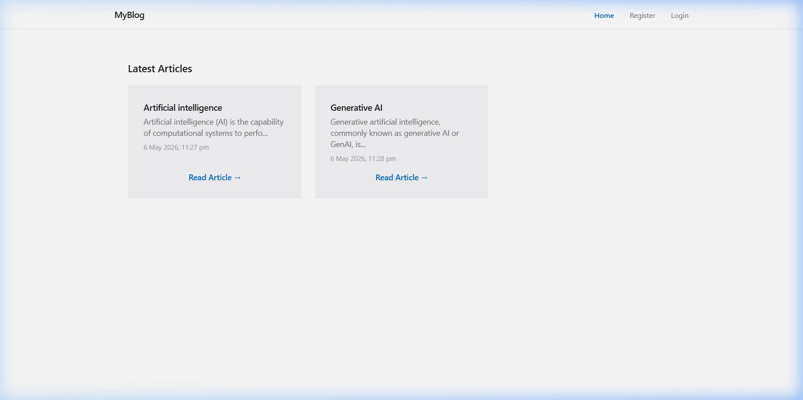
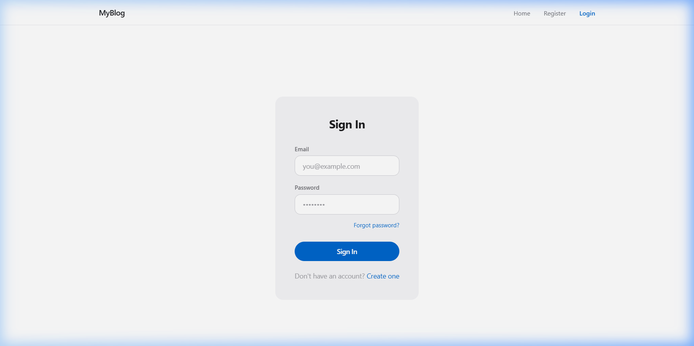
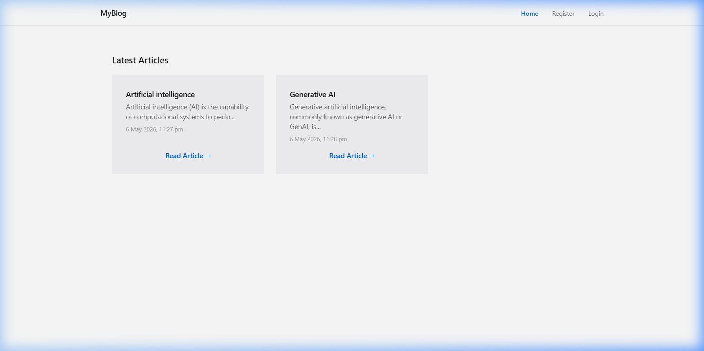
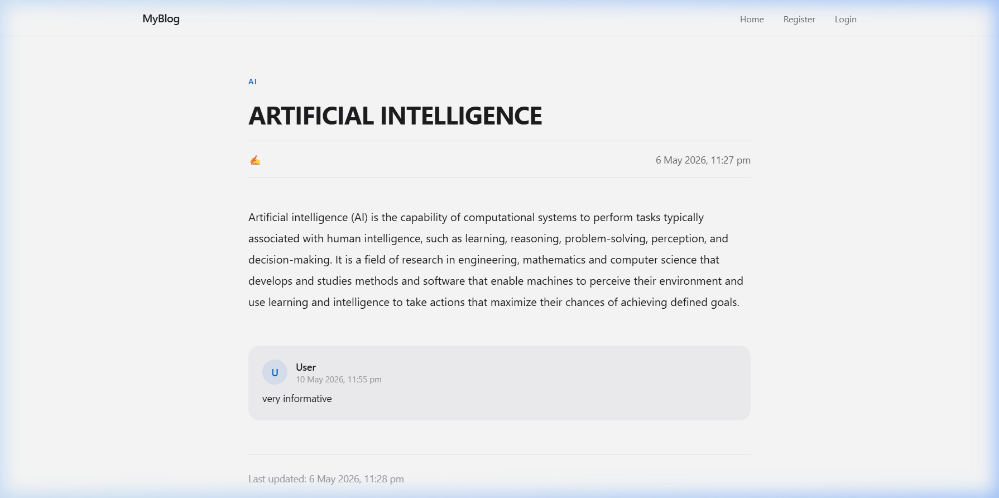

# 📝 MyBlog - A Modern Full-Stack Blogging Platform

[](https://blog-app-git-main-amulyamandala007-gmailcoms-projects.vercel.app/)
[](https://reactjs.org/)
[](https://nodejs.org/)
[](https://www.mongodb.com/)

MyBlog is a feature-rich, full-stack blogging application designed for a premium reading and writing experience. Built with the MERN stack (MongoDB, Express, React, Node.js), it offers a clean aesthetic with dynamic content management and secure user authentication.

🔗 **Live Demo:** [Visit MyBlog](https://blog-app-git-main-amulyamandala007-gmailcoms-projects.vercel.app/)

---

## 📸 Screenshots

| Landing Page | Auth Interface |
| :---: | :---: |
|  |  |
| **Blog Feed** | **Article Detail** |
|  |  |

---

## ✨ Key Features

- **🔐 Secure Authentication**: JWT-based authentication with bcrypt password hashing and HTTP-only cookie storage.
- **📰 Dynamic Content**: Explore a variety of articles across different categories like AI, Web Development, and more.
- **✍️ Rich Article Views**: Beautifully formatted article pages with author attribution and publication timestamps.
- **💬 Engagement System**: Interactive comment section for user discussions on every post.
- **🖼️ Image Management**: Integrated with **Cloudinary** for efficient and reliable image hosting and optimization.
- **🎨 Premium UI/UX**: A responsive and modern design built with **React 19** and **Tailwind CSS 4**.
- **⚡ Performance Optimized**: Fast loading times and smooth transitions powered by **Vite**.

---

## 🛠️ Tech Stack

### Frontend
- **Framework**: React 19
- **Styling**: Tailwind CSS 4
- **State Management**: Zustand
- **Form Handling**: React Hook Form
- **Routing**: React Router 7
- **Notifications**: React Hot Toast & React Toastify
- **HTTP Client**: Axios

### Backend
- **Server**: Node.js & Express
- **Database**: MongoDB (Mongoose ODM)
- **Authentication**: JSON Web Tokens (JWT)
- **File Uploads**: Multer & Cloudinary
- **Security**: Bcrypt.js, CORS, Cookie-parser

---

## 🚀 Getting Started

To run this project locally, follow these steps:

### Prerequisites
- Node.js (v18 or higher)
- MongoDB Atlas account or local MongoDB instance
- Cloudinary account for image storage

### Installation

1. **Clone the repository:**
   ```bash
   git clone https://github.com/amulyamandala/blogApp.git
   cd blogApp
   ```

2. **Setup Backend:**
   ```bash
   cd backend
   npm install
   ```
   Create a `.env` file in the `backend` directory and add:
   ```env
   PORT=5000
   MONGO_URI=your_mongodb_connection_string
   JWT_SECRET=your_jwt_secret
   CLOUDINARY_CLOUD_NAME=your_cloud_name
   CLOUDINARY_API_KEY=your_api_key
   CLOUDINARY_API_SECRET=your_api_secret
   ```
   Start the backend:
   ```bash
   npm start
   ```

3. **Setup Frontend:**
   ```bash
   cd ../blogfrontend
   npm install
   ```
   Start the development server:
   ```bash
   npm run dev
   ```

---

## 📂 Project Structure

```text
├── backend/            # Express server, MongoDB models, and APIs
│   ├── APIs/           # API route handlers
│   ├── Models/         # Mongoose schemas
│   └── server.js       # Entry point
├── blogfrontend/       # React application (Vite)
│   ├── src/            # Components, pages, and logic
│   └── public/         # Static assets
└── assets/             # Project documentation assets
    └── screenshots/    # App screenshots
```

##
Developed by **Amulya Mandala**.
